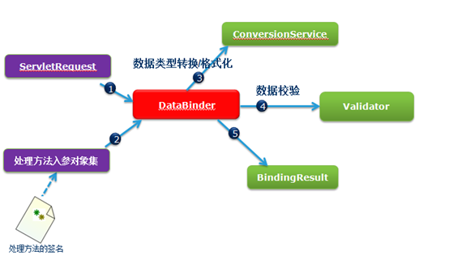

# springmvc入门
1. 新建web项目
2. 导包
3. 配置web.xml中的中央控制器dispatchServlet
4. 配置spring-mvc.xml配置文件
5. 书写入门程序HelloController

# 请求映射和请求数据绑定
## url和请求方法限定(PartOneController)
1. 一个方法匹配多个路径  
@RequestMapping(value= {"/multi1","/multi2","/multi3"})
2. 匹配通配符(Ant风格映射,*表示一层，**表示多层,?表示匹配一个字符)
	1. `@RequestMapping("/user/*/addUser")`:/user/sss/addUser
	2. `@RequestMapping("/user/**/addUser")`:/user/555/666/777/addUser
3. url模板映射,{userId}表示接收一个用户的id
```
@RequestMapping("/user/{userId}")
public String four(@PathVariable("userId")int userId) {
```
4. 通过get或post来区分请求的不同
GET方式
```
@RequestMapping(value="/user/add",method=RequestMethod.GET)
public String five() {
```
POST方式
```
@RequestMapping(value="/user/add",method=RequestMethod.POST)
public String six() {
```

## 根据请求参数限定url(PartTwoController)
1. 使用@RequestParam注解参数，@RequestParam注意里面username要和表单参数名一致。一旦用了注解，参数时必须的。除非加一个属性required=false
```
@RequestMapping(value= {"regist"})
public String one(@RequestParam("username")String username,@RequestParam(value="password",required=false)String password) {
```
2. 不使用@RequestParam注解参数,参数可有可无，只需参数名与表单参数明一直即可
```
@RequestMapping(value= {"regist"})
public String one(@RequestParam("username")String username,@RequestParam(value="password",required=false)String password) {
```
3. 支持正则表达式的url
```
@RequestMapping(value="/updateUser/{userId:\\d+}-{userName:[a-z]+}")
public String three(@PathVariable("userId") String userId,@PathVariable("userName") String userName){
```
4. 封装对象的参数绑定，只需封装对象的属性与表单参数对应即可
```
@RequestMapping("/register2")
public String four(User user){
```

## 请求参数绑定(PartThreeController)
1. @ModelAttribute注解,@ModelAttribute注解会将参数放到request作用域
```
@RequestMapping("/register3")
public String register3(@ModelAttribute("user")User user){
```

## springMvc参数绑定机制


## 参数绑定错误(可能为格式转换不成功)，报错400
三种解决方式
1. 页面用js判断该字段不能为空
2. 默认给input控件初始值，比如int型可以给value属性赋值0
3. 后台定义converter(实现spring的converter接口)，然后进行注册，注册到conversion-service对应bean当中。
配置方式
```
<!-- 消息转换器服务类 -->
<bean id="conversionService" class="org.springframework.format.support.FormattingConversionServiceFactoryBean">
	<property name="converters">
		<list>
			<bean class="com.group.converter.StringToDateConverter"></bean>
		</list>
	</property>
</bean>
<!-- requestMappingHandler,handlerAdapter请求匹配处理器，适配器两个对象 -->
<mvc:annotation-driven conversion-service="conversionService"/>
```

# 模型和视图解析ModelAndView
## 模型部分(ModelController)
1. 通过在形参声明model，map，modelMap类型自动获取model对象，然后向其中放入keyvalue对，最终参数将自动封装到request中。
```
@RequestMapping("/model1")
public String model1(Model model,Map map,ModelMap mm){
```
2. 将数据放到原生的request,session
```
@RequestMapping("/model2")
public String model2(HttpServletRequest request,HttpSession se){
```

## 视图解析器(ViewController)
### 页面跳转
1. 请求跳转  
`return "forward:/success.jsp";`
2. 页面重定向  
`return "redirect:/success.jsp";`

### 静态资源处理
Springmvc默认是不可以访问静态资源。静态资源包括html，js,css,image.因为springmvc的控制器dispatcherServlet拦截了所有资源，就会将login.html当成一个普通字符串处理，去找处理器，找不到就要报404.但是如果直接访问的是login.jsp，因为jsp是动态的，所以是可以访问的。若要访问静态资源:  
**方法一：**通过mvc提供的一个标签，加入到springmvc.xml配置文件。  
```
<!-- 为了访问静态资源 -->
<mvc:default-servlet-handler/>
```
这个配置实际上是将请求的url对应的静态资源交给了tomcat带的那个defaultServlet处理了  
**方法二：**但是如果静态网页的名称恰好等于某个controller里面的requetmapping，这个时候静态网页不会显示出来，法一则不起作用。  
在法一的基础上，再Web.xml中加入如下代码：
```
<servlet-mapping>
  	<servlet-name>default</servlet-name>
	<url-pattern>*.html</url-pattern>  
</servlet-mapping>
<servlet-mapping>
  	<servlet-name>default</servlet-name>
	<url-pattern>*.js</url-pattern>  
</servlet-mapping>
<servlet-mapping>
  	<servlet-name>default</servlet-name>
	<url-pattern>*.css</url-pattern>  
</servlet-mapping>
```  
**法三：**通过mvc：resouces标签完成restful的url和对应的具体location的映射(测试文件为：resource.jsp)。  
首先也要配置<mvc:default-servlet-handler/>  
然后加上：
```
<!-- 静态资源的映射 -->
<mvc:resources location="/css/" mapping="/styles/**"></mvc:resources>
<mvc:resources location="/js/" mapping="/script/**"></mvc:resources>
```
如果静态资源放到web-inf受保护的目录下，就只能使用法三映射。这种情况下页面引入：
`<link rel="stylesheet" type="text/css" href="styles/bootstrap.css">`

# 文件上传，拦截器和异常处理
## 文件上传(FileUploadController)
1. 配置文件上传解析器bean(有两种)
	* servlet3.0的  
	spring-mvc.xml中的配置
	```
	<bean id="multipartResolver"
        class="org.springframework.web.multipart.support.StandardServletMultipartResolver">
	</bean>
	```
	web.xml中的配置
	```
	<!-- 配置springmvc的中央控制器 -->
  	<servlet>
	  	<servlet-name>dispatch</servlet-name>
	  	<!-- 让该servlet在tomcat启动的时候就加载,先加载,因为数值是1 -->
	    <load-on-startup>1</load-on-startup>
	  	<servlet-class>org.springframework.web.servlet.DispatcherServlet</servlet-class>
	  	<init-param>
	  		<param-name>contextConfigLocation</param-name>
	  		<param-value>WEB-INF/spring-mvc.xml</param-value>
	  	</init-param>
	  	<!-- 配置上传文件最大大小 -->
	  	<multipart-config>
	  	  <max-file-size>512000000</max-file-size>
	  	</multipart-config>
	</servlet>
	<servlet-mapping>
	  	<servlet-name>dispatch</servlet-name>
	  	<url-pattern>/</url-pattern>  
	</servlet-mapping>
	```
	* Commons包下的  
	```
	<bean id="multipartResolver"
        class="org.springframework.web.multipart.commons.CommonsMultipartResolver">
    	<!-- one of the properties available; the maximum file size in bytes -->
    	<property name="maxUploadSize" value="100000"/>
	</bean>
	```
2. jsp页面配置，后台书写
	* jsp文件表单中添加属性  
	`<form action="/learn_springmvc/upload" method="post" enctype="multipart/form-data">`
	* 后台MartPartFile对象的transferTo()方法  
	`FileUploadController.upload`

## 拦截器(HelloInterceptor)
1. 实现接口HandlerInterceptor
2. 在spring-mvc.xml中配置拦截器
```
<!-- 配置一个拦截器 -->
<mvc:interceptors>
	<mvc:interceptor>
   		<mvc:mapping path="/**"/>
		<bean class="com.group.interceptor.HelloInterceptor"></bean>
	</mvc:interceptor>
</mvc:interceptors>
```

## 异常处理解析器
1. 实现接口HandlerExceptionResolver
2. 在spring-mvc.xml中配置异常处理解析器
```
<!-- 配置异常处理解析器 -->
<bean id="exceptionResolver" class="com.group.exception.HelloExceptionHandlerResolver"></bean>
```

## 在web.xml中配置编码过滤器
注意要将编码过滤器写在中央控制器dispatch的钱满
```
<!-- 配置一个编码过滤器 -->
<filter>
	<filter-name>encoding</filter-name>
  	<filter-class>org.springframework.web.filter.CharacterEncodingFilter</filter-class>
</filter>
<filter-mapping>
  	<filter-name>encoding</filter-name>
	<url-pattern>/*</url-pattern>
</filter-mapping>
```
